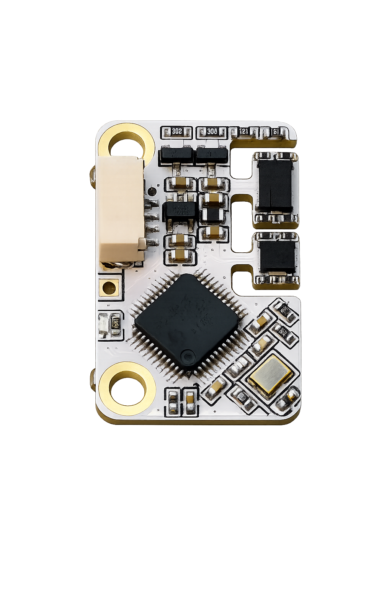

# 双 IMU 融合恒温姿态模块用户手册

## 1. 产品简介

本模块是一款面向高稳定姿态测量的双 IMU 融合模块，内置 BMI088 与 BMI270/BMI220 双传感器通道，支持恒温控制、自动零漂校准和串口数据输出。

产品特性：

- 双 IMU 融合输出，抗短时冲击与随机噪声能力更强。
- 恒温闭环控制，自带加热电路温度可调，范围覆盖 40-90°C。
- 上电自动零漂校准，典型零漂低于 1°/h。
- 支持 `USE` 与 `DEBUG` 两种输出模式。
- 支持串口配置、参数保存与状态查询。

## 2. 快速使用

1. 固定模块并保持静止。
2. 上电，等待自动加热与零漂校准完成。
3. 串口按默认参数打开：`921600, 8N1`。
4. 正常工作建议使用 `USE` 模式，模块会持续输出：

```text
Pitch,Roll,Yaw
```

示例：

```text
1.234,-0.567,12.345
```

单位为度。

## 3. 状态指示灯

| LED 状态 | 含义 |
| --- | --- |
| 快闪 | 异常状态，例如 IMU 识别失败或温度异常 |
| 慢闪 | 模块正常，正在等待温度到位 |
| 常亮 | 温度到位，模块正常输出 |
| 熄灭 | 正在回复命令或暂未进入输出状态 |

## 4. 上电与自动校准

模块上电后会自动读取已保存参数。若已存在有效零漂数据，会直接进入工作状态。

若无有效零漂数据，模块会自动执行校准：

1. 等待两颗 IMU 温度进入目标温度 ±2°C。
2. 记录 30 秒静止数据。
3. 保存零漂并进入正常输出。

自动校准期间串口可能输出：

```text
CAL_WAIT:AUTO_TEMP
CAL_WAIT:T088=39.875,T270=40.012
CAL_WAIT:DONE
CAL:START
CAL_REMAIN:30
...
CAL:DONE
```

进入 `CAL_REMAIN` 倒计时后，请保持模块静止。

## 5. 串口参数

| 参数 | 默认值 |
| --- | --- |
| 波特率 | 921600 |
| 数据位 | 8 |
| 校验位 | None |
| 停止位 | 1 |
| 行结束 | `\n`，兼容 `\r\n` |

支持波特率：

```text
115200 / 230400 / 460800 / 921600
```

## 6. 数据输出格式

### USE 模式

正式使用模式，只输出融合姿态：

```text
Pitch,Roll,Yaw
```

### DEBUG 模式

调试模式，输出两颗 IMU 与融合结果：

```text
BMI088_Pitch,BMI088_Roll,BMI088_Yaw,BMI270_Pitch,BMI270_Roll,BMI270_Yaw,Virtual_Pitch,Virtual_Roll,Virtual_Yaw
```

回传频率可通过 `RATE` 设置，范围：

```text
1 - 500 Hz
```

## 7. 命令格式

命令为 ASCII 文本，以换行结束：

```text
COMMAND ARG1 ARG2
```

参数可使用空格、TAB 或逗号分隔。建议使用大写命令。

模块收到命令后会暂停姿态输出约 3 秒，并回复：

```text
OK
RECV:<收到的命令>
```

除 `STATUS` 外，配置类命令成功后会自动保存并重启。

## 8. 命令列表

| 命令 | 参数 | 说明 |
| --- | --- | --- |
| `STATUS` | 无 | 查询当前状态 |
| `CAL` | 等待秒数, 记录秒数 | 手动零漂校准 |
| `TEMP` | 目标温度 | 设置恒温目标 |
| `BAUD` | 波特率 | 设置串口波特率 |
| `RATE` | 回传频率 | 设置数据输出频率 |
| `MODE` | `USE` 或 `DEBUG` | 设置输出模式 |

## 9. 常用命令

### 查询状态

```text
STATUS
```

典型回复：

```text
OK
RECV:STATUS
BAUD:921600
RATE:50
MODE:USE
TARGET_TEMP:40.000
BMI088_MODEL:BMI088
BMI270_MODEL:BMI220
BMI088_TEMP:39.875
BMI270_TEMP:40.012
BMI088_HEAT:0.230
BMI270_HEAT:0.180
IMU_OVERRUN:0
```

常用字段：

| 字段 | 含义 |
| --- | --- |
| `BAUD` | 当前波特率 |
| `RATE` | 当前回传频率 |
| `MODE` | 输出模式 |
| `TARGET_TEMP` | 目标温度 |
| `BMI088_MODEL` | 第一颗 IMU 型号 |
| `BMI270_MODEL` | 第二颗 IMU 型号 |
| `BMI088_TEMP` | BMI088 当前温度 |
| `BMI270_TEMP` | BMI270/BMI220 当前温度 |
| `BMI088_HEAT` | BMI088 加热输出，0.000 - 1.000 |
| `BMI270_HEAT` | BMI270/BMI220 加热输出，0.000 - 1.000 |
| `IMU_OVERRUN` | 输出或计算超时计数，正常不应持续增加 |

完整 `STATUS` 还可能包含零漂、饱和计数等诊断字段。

### 手动零漂校准

```text
CAL 10 60
```

含义：等待 10 秒后记录 60 秒静止数据。校准期间必须保持模块静止。成功后模块会保存参数并重启。

### 设置目标温度

```text
TEMP 40
```

目标温度单位为 °C。推荐常用目标为 40°C，也可根据应用需求设置更高恒温点。

### 设置波特率

```text
BAUD 921600
```

支持：`115200`、`230400`、`460800`、`921600`。修改后需用新波特率重新打开串口。

### 设置输出频率

```text
RATE 50
```

范围：`1 - 500 Hz`。

### 设置输出模式

```text
MODE USE
MODE DEBUG
```

`USE` 用于正式输出，`DEBUG` 用于调试对比。

## 10. 错误回复

| 回复 | 含义 |
| --- | --- |
| `ERROR:BAD_ARG` | 参数错误或超出范围 |
| `ERROR:UNKNOWN_COMMAND` | 未知命令 |
| `ERROR:SAVE_FAILED` | 参数保存失败 |
| `ERROR:CAL_FAILED` | 零漂校准失败 |
| `ERROR:IMU_INIT_FAILED` | IMU 识别或初始化失败 |
| `ERROR:COMMAND_OVERFLOW` | 命令过长或接收队列溢出 |

